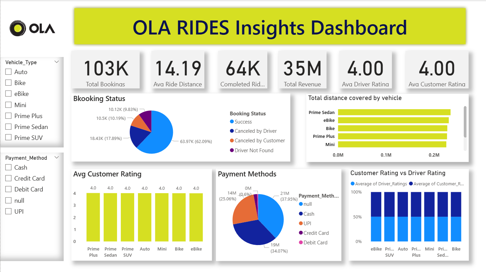

# 🚖 OLA Rides Analytics Dashboard

 
 

---

# 📌 Project Overview

This project provides an end-to-end Data Analytics solution for OLA ride bookings. 
using **SQL, Power BI, and Python**. The project analyzes booking trends, revenue, ride cancellations, payment methods, customer ratings, and vehicle performance to generate meaningful business insights.

---

# 🎯 Objectives

- Analyze ride booking data using SQL.
- Build an interactive Power BI Dashboard.
- Generate business insights from ride data.
- Visualize KPIs and booking trends.
- Perform revenue and customer analysis.

---

# 🛠 Tech Stack

- **SQL (MySQL)** – Data Analysis
- **Power BI** – Dashboard & Visualization
- **Python** – Data Processing
- **Excel / CSV** – Dataset
- **Git & GitHub** – Version Control

---

# 📂 Project Files

- 📊 OLA.pbix
- 🗄️ ola.sql
- 📄 OLA_Queries.pdf
- 📑 OLA Queries.pptx
- 📈 OLA_DataSet.xlsx
- 📋 Ola_dataset.csv
- 🖼 Dashboard.png

---

# 📊 SQL Analysis

The SQL analysis includes:

- Successful Bookings
- Ride Distance Analysis
- Revenue Analysis
- Payment Method Analysis
- Top Customers
- Booking Status Analysis
- Customer Rating Analysis

---

# 📈 Power BI Dashboard

The dashboard contains:

- Total Bookings
- Total Revenue
- Completed Rides
- Average Ride Distance
- Driver Rating
- Customer Rating
- Booking Status
- Vehicle-wise Distance
- Payment Method Analysis

---

# 📷 Dashboard Preview

---

# 💡 Business Insights

- Prime Sedan generated the highest revenue.
- UPI is the most preferred payment method.
- Completed rides contribute the majority of bookings.
- Customer ratings remain consistently high.
- Ride demand varies across vehicle categories.

---

# 🚀 Tools Used

- MySQL
- Power BI
- Microsoft Excel
- Python
- GitHub

---

# 📬 Author

**Abdul Rehman**

📧 Data Analyst Portfolio Project

⭐ If you like this project, don't forget to Star the repository.
